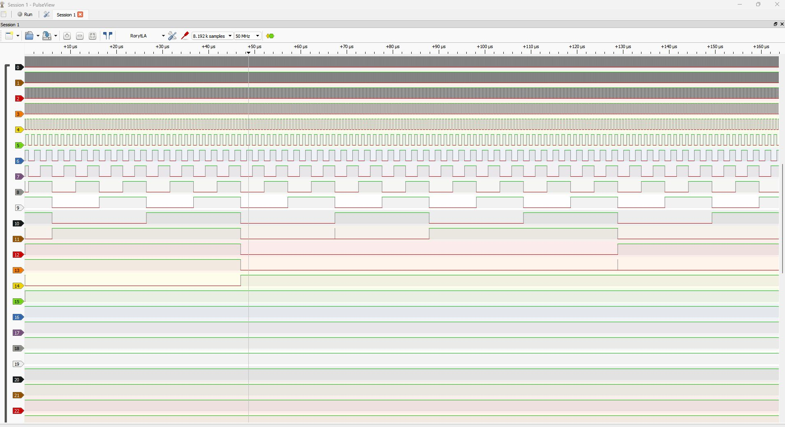
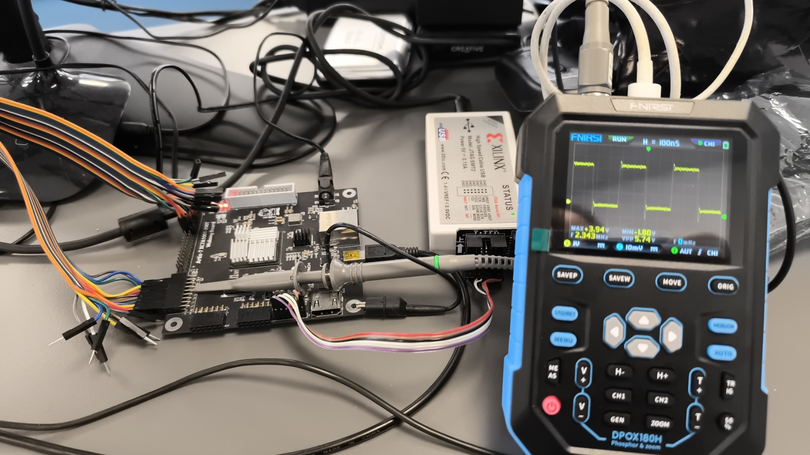

# FPGA Logic Analyzer

A 32-channel logic analyzer built in VHDL for the QMTech Wukong board (Artix-7 xc7a100tfgg676-1).

I recently needed an analyser for a retro-computer repair project, and I realized that I can build a pretty decent one with minimum cost, with one of my spare FPGA development boards.





## Hardware

| Item | Details |
|------|---------|
| **FPGA board** | QMTech Wukong (Artix-7 xc7a100tfgg676-1) |
| **System clock** | 150 MHz generated by PLL |
| **Probes** | 32 channels via J12 header (pins 3–34) |
| **UART** | FTDI USB UArt at 3 Mbps |
| **Test outputs** | 16 channels via JP2 header (clock dividers) |

J12 is a 2×20 pin header: pin 1 = GND, pin 2 = VIN (3.3V), channels start at pin 3.

## Features

- **32 probe channels** (easily expandable)
- **150 MHz max sample rate** (configurable divider, 20-bit)
- **SUMP protocol v2** — works with sigrok-cli and PulseView via the stock `ols` driver
- **4-stage trigger** with mask + value per stage, level or edge mode
- **8192 samples** circular BRAM capture (32-bit per sample, 1 BRAM36)
- **16 test clock outputs** on JP2 (counter-divided from 150 MHz)
- **2 status LEDs** (Data acquisition / UART readout)

## Quick Start

### Linux

```bash
# Scan device
sigrok-cli --driver ols:conn=/dev/ttyUSB0:serialcomm=3000000/8n1 --scan

# Capture 8192 samples at 150 MHz
sigrok-cli --driver ols:conn=/dev/ttyUSB0:serialcomm=3000000/8n1 \
  -c samplerate=150000000 \
  --samples 8192 \
  -o capture.sr

# Capture with rising-edge trigger on channel 7
sigrok-cli --driver ols:conn=/dev/ttyUSB0:serialcomm=3000000/8n1 \
  -c samplerate=10000000 \
  --triggers 7=r \
  --samples 4096 \
  -o capture.sr
```

### Windows

```cmd
"C:\Program Files\sigrok\sigrok-cli\sigrok-cli" -d ols:conn=COM3:serialcomm=3000000/8n1 --scan

"C:\Program Files\sigrok\sigrok-cli\sigrok-cli" -d ols:conn=COM3:serialcomm=3000000/8n1 -c samplerate=150000000 --samples 8192 -o capture.sr

"C:\Program Files\sigrok\sigrok-cli\sigrok-cli" -d ols:conn=COM3:serialcomm=3000000/8n1 -c samplerate=10000000 --triggers 7=r --samples 4096 -o capture.sr
```

Open the `.sr` file in PulseView for waveform visualization. 

You can also connect and capture directly from PulseView GUI without the CLI. 

Click on Device select the "Openbench Logic Sniffer & SUMP compatibles (ols), → Serial Port → 30000 for baud → press "Scan for devices using driver above"

## Pinout

| Signal | Pin | Note |
|--------|-----|------|
| `i_sys_clk` | M21 | 50 MHz oscillator from board |
| `i_rstn` | M6 | CPU reset button |
| `i_raw_sig[31:0]` | J12 pins 3–34 | 32 probe channels |
| `i_rx` | F3 | FTDI UART RX |
| `o_tx` | E3 | FTDI UART TX |
| `o_triggered_led` | V16 | Acquisition LED (active-low) |
| `o_enabled` | V17 | Readout LED (active-low) |
| `o_jp2_test[15:0]` | JP2 pins 3–18 | Test clock outputs |

Full pinout for all 32 probe channels is in `notes.md`.

## Project Structure

```
├── src/
│   ├── logic_analyzer.vhd   # Top-level entity
│   ├── sump_core.vhd            # SUMP protocol engine + trigger
│   ├── sram.vhd                 # Circular BRAM buffer
│   ├── pll_wrapper.vhd          # MMCME2 PLL (50 MHz → 150 MHz)
│   ├── uart.vhd                 # UART wrapper
│   ├── uart_rx.vhd              # UART receiver
│   └── uart_tx.vhd              # UART transmitter
```


## SUMP Protocol

The analyzer implements SUMP protocol v2 partially. See `notes.md` for the full command reference and trigger system details.

## In Progress

- [ ] 5V → 3.3V level shifters for probing 5V TTL signals
- [ ] Input probes with probe clips
- [ ] Maybe XON/XOFF ? 




